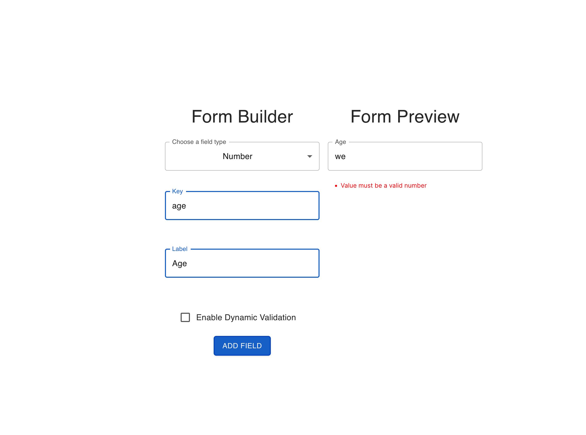
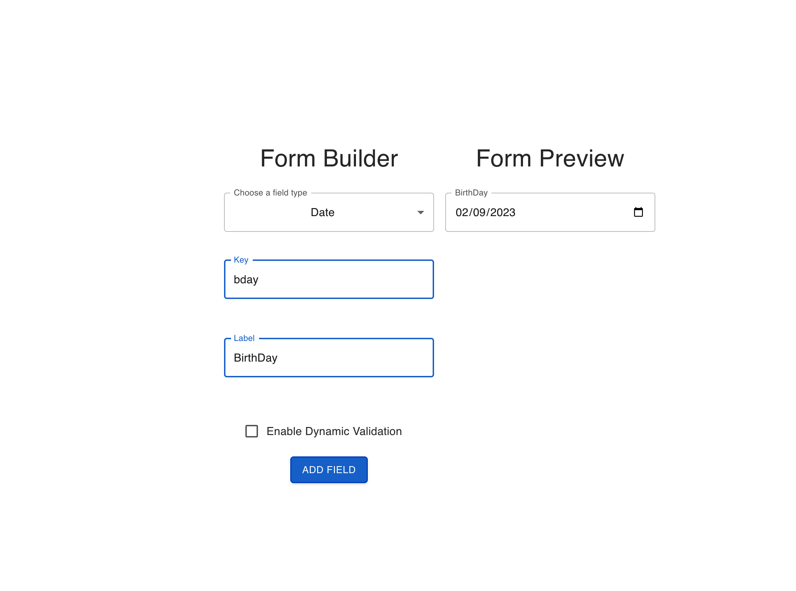
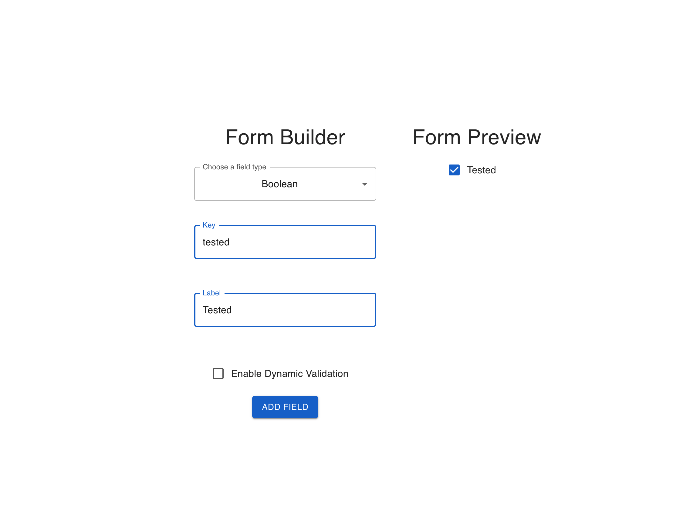
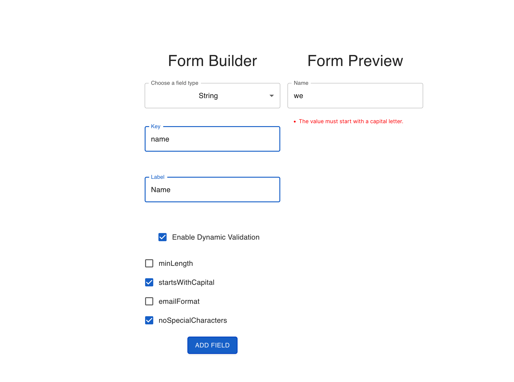
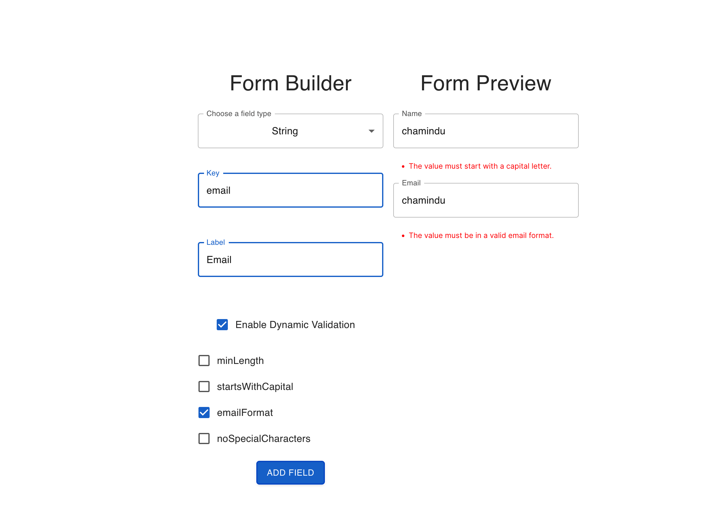
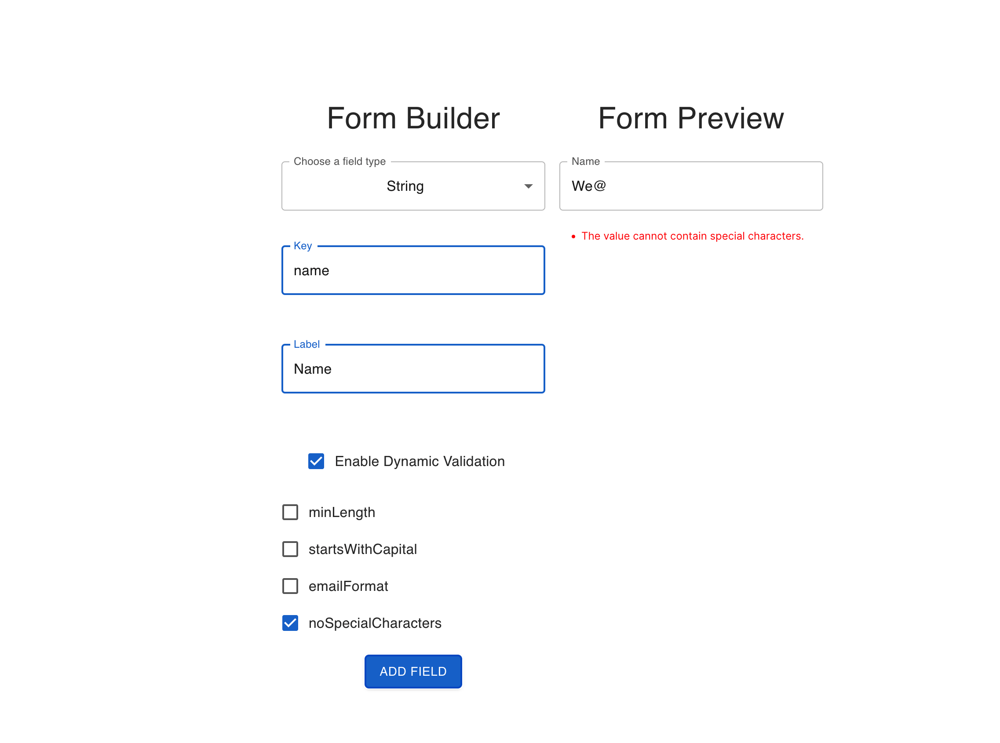
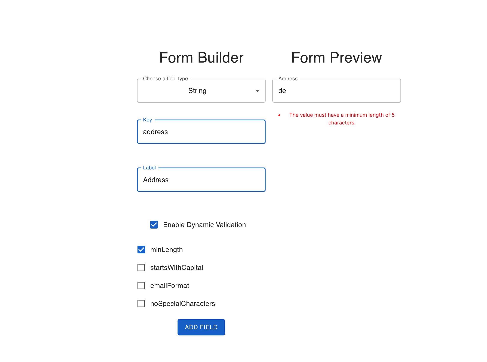

# Form Builder

## Overview

The Form Builder application is tasked with improving its field input validation and introducing dynamic validation settings. The two primary tasks are as follows:

## Task 1: Field Input Validation

#### Approach

The initial task focuses on implementing input validation for each field based on its assigned type. This validation should activate upon the blur event for each field, ensuring immediate feedback for users.

#### Solution

- Specific validation rules were tailored for different field types, such as "Number."
- The `validateFieldValue` function was introduced to manage and execute the validation logic.
- Integration of Redux was undertaken to efficiently control the application's state and facilitate error handling.

#### Rationale

- By centralizing the validation logic within the `validateFieldValue` function, the codebase was kept organized and easy to manage.
- The use of Redux enhanced the error management system, providing a structured way to handle and display errors consistently.

### Correct Data Type Validation

## Task 2: Dynamic Validation Setting

### Approach

The secondary task involves implementing a dynamic validation feature, enabling users to define their validation rules through the application interface. This dynamic validation should be versatile and easily adaptable to varying rules without requiring extensive codebase changes.

### Solution

- Users can select dynamic validation rules for specific fields directly from the user interface.
- A `validationRules` configuration was introduced, mapping rule names to corresponding validation functions.
- The `validateFieldValue` function was extended to incorporate dynamic validation rules.
- An innovative approach was devised to facilitate dynamic rule-setting while minimizing codebase adjustments.

### Rationale

- The adoption of a configuration-based approach ensured scalability without compromising existing code integrity.
- The design approach enabled the straightforward integration of new validation rules by expanding the `validationRules` object.

### Validation Screenshots

Here are some screenshots showcasing different validation scenarios :

### Dynamic Validation Rules

